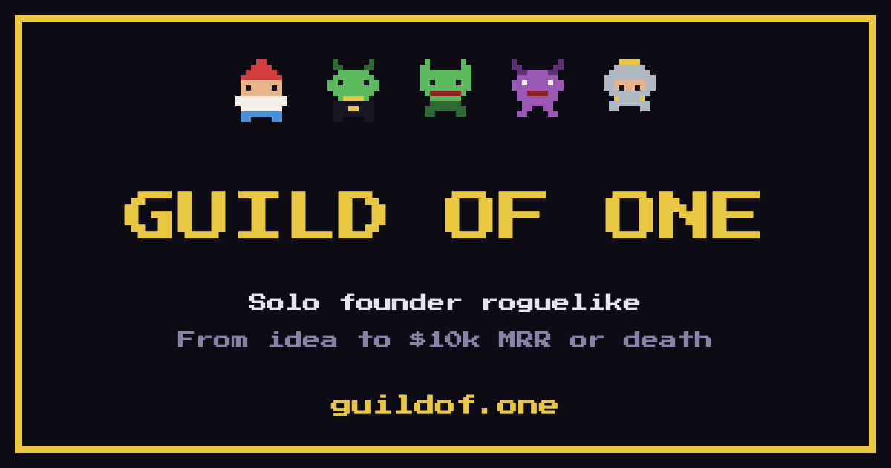

<div align="center">



**[▶ Играть — guildof.one](https://guildof.one)** · без регистрации, сейв в localStorage

</div>

---

# Guild of One

Пошаговый roguelike-симулятор запуска продукта соло-основателем: от идеи до **$10k MRR** или смерти.

Ты — соло-фаундер. У тебя есть сбережения, фиксированный запас энергии в день и хрупкая мотивация. Каждый ход (день) ты решаешь, куда их потратить: валидировать идею, пилить фичу, постить в канал, отвечать хейтерам-гоблинам. Мир подкидывает случайности — от фичеринга на Product Cave до падения прода в пятницу вечером.

Провалился (деньги или мотивация в ноль) — новый ран, новая идея.

## Формула

```
Game Dev Tycoon (симулятор с цифрами)
        +
roguelike (короткие раны, перманентная смерть, рандом)
        +
самоирония индихакерства (churn, «ещё одна фича», лонч в пустоту)
        +
фэнтези-антураж (дракон-инвестор, гоблины-хейтеры)
```

Сюжетных веток нет — только системная симуляция и случайные события.

## Как играет ран

1. **Выбираешь фаундера.** Кодер (разработка −50% энергии, маркетинг +50%, аудитория 0), Маркетолог (наоборот, аудитория 500), Универсал (без модификаторов, но $6 000), Экс-корпорат ($12 000, но всё +25% энергии и мотивация тает быстрее).
2. **Выбираешь нишу** и получаешь стартовые цифры.
3. **Тратишь ходы.** Каждый день — ограниченная энергия на действия: валидация, разработка, маркетинг, поддержка, отдых.
4. **Ловишь события.** Фичеринг, отвал клиента, выгорание, инвестор — все с лицами-персонажами.
5. **Доходишь до $10k MRR** — или до нуля на деньгах/мотивации.

Игра молча наказывает цифрами за антипаттерны — запуск без валидации, распыление на три канала, фичи вместо маркетинга. Без менторских нотаций: просто MRR не растёт.

## Запуск локально

```bash
pnpm install
pnpm dev        # http://localhost:3000
pnpm build      # статический экспорт (out/)
pnpm sim        # авто-симуляция баланса на ботах
```

Node 20+. Деплой — GitHub Pages через `.github/workflows/deploy.yml`.

## Структура

| Путь | Что внутри |
|---|---|
| `lib/engine/` | движок симуляции — чистый TS, без React |
| `lib/engine/balance.ts` | **все числа игры в одном файле** — крутить баланс только здесь |
| `lib/engine/content/` | декларативные данные: ниши, события, персонажи, действия, найм, инсайты |
| `lib/store.ts` | Zustand + автосейв в localStorage |
| `components/` | UI: Next.js App Router + Tailwind |
| `scripts/simulate.ts` | боты-стратегии — проверяют, что методология побеждает, а антипаттерны наказываются |
| `docs/` | требования: концепция, геймплей, симуляция, события, экраны, тех-часть |

Движок отделён от UI намеренно: `pnpm sim` гоняет тысячи ранов на ботах без браузера, поэтому баланс проверяется цифрами, а не на ощупь.

## Требования

Полные требования — в [docs/](docs/README.md): [концепция](docs/01-concept.md), [геймплей](docs/02-gameplay.md), [симуляция](docs/03-simulation.md), [события и персонажи](docs/04-events-characters.md), [экраны](docs/05-ui-screens.md), [техчасть](docs/06-tech.md).

## Лицензия

MIT
